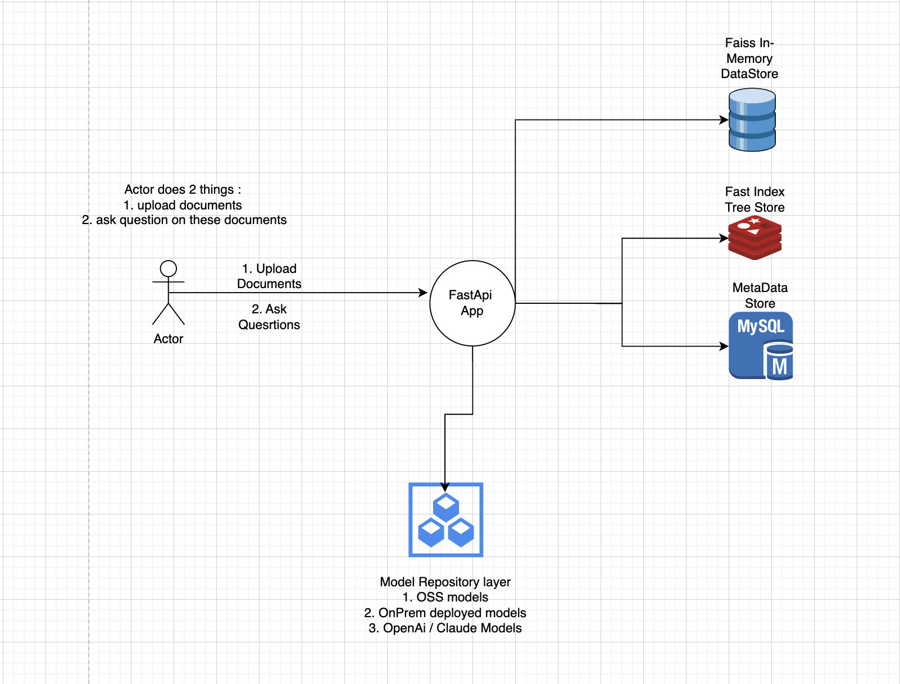
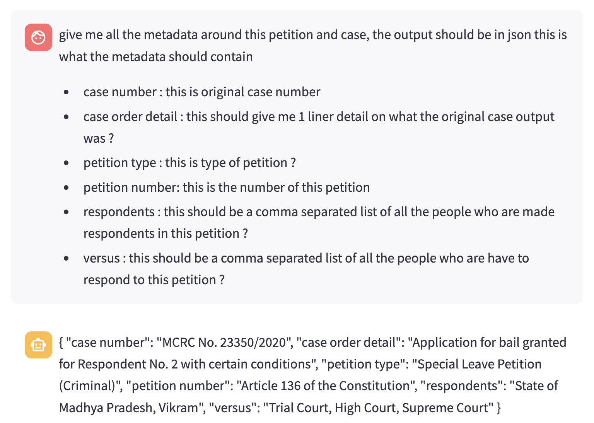

# What ?? 
- This is a RAG + QA application that acts as a RAG pipeline using State of Art (RAPTOR : https://arxiv.org/abs/2401.18059) framework for Legal Use-Cases.

## What it can be used as ? 
- It is a good retriever, use-case : if you have a bunch of same case related files example : petition files, case order details across a timeline this is a system to ingest all that data and then ask questions across all the files.

- Question could be like this : <br/>
	a) when was the original case dated ? <br/>
	b) what is original case number ? <br/>
	c) what was the result of original case ? <br/>
	d) what all petitions have been submitted there-after ? <br/>
	e) what was the result per petition ? <br/> ...


## Tech Stack 
- FastApi : Web / Rest Api <br/>
- Redis / Mysql : DataStores <br/>
- Langchain : Chaining <br/>
- Streamlit : Simple UI <br/>

## Want to see it in action ? 
```
1. you would need a OPEN_API_KEY env var, see docker-compose.yml for details. 
2. do a docker compose -f docker-compose.yml up 
3. goto localhost:5001 to see frontend. 
```

## HLD



## Some example question / answer pairs. 
If you want to see which petition I am referring to here it is this :  `./src/sample/special_leave_petition.pdf`

Q : what all questions have been asked in this petition and what all proofs do they have to back this up ? 


Q : Questions around metadata from the petition, includes case number, reason for petition etc. 



## Usage 
Upload Petition Files and then ask questions.
